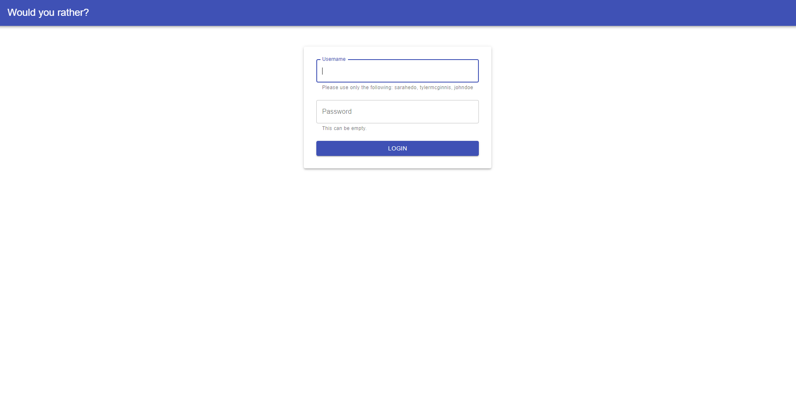
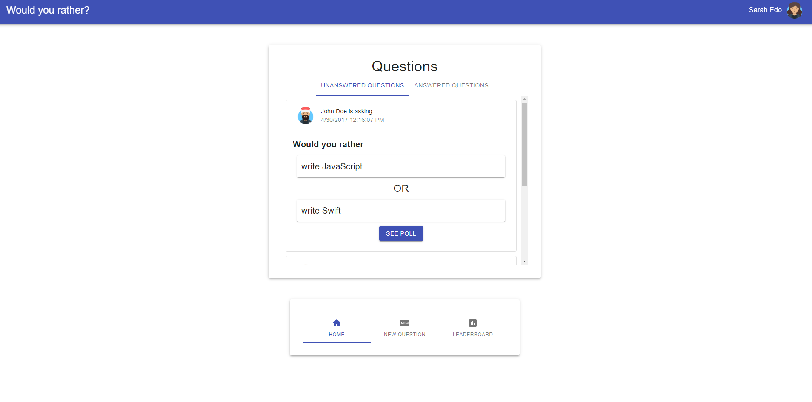
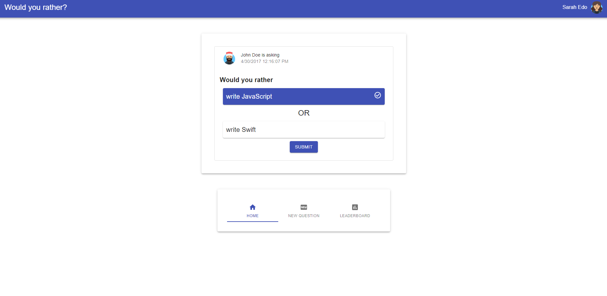
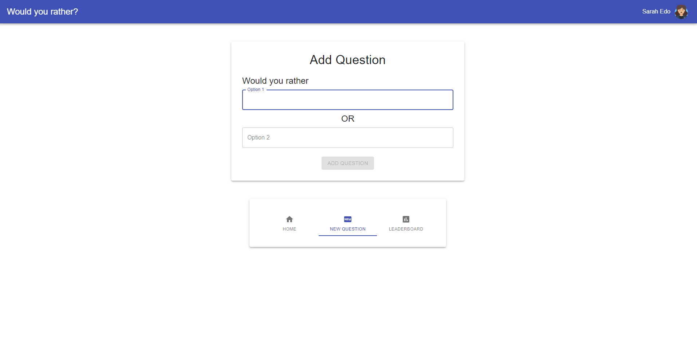
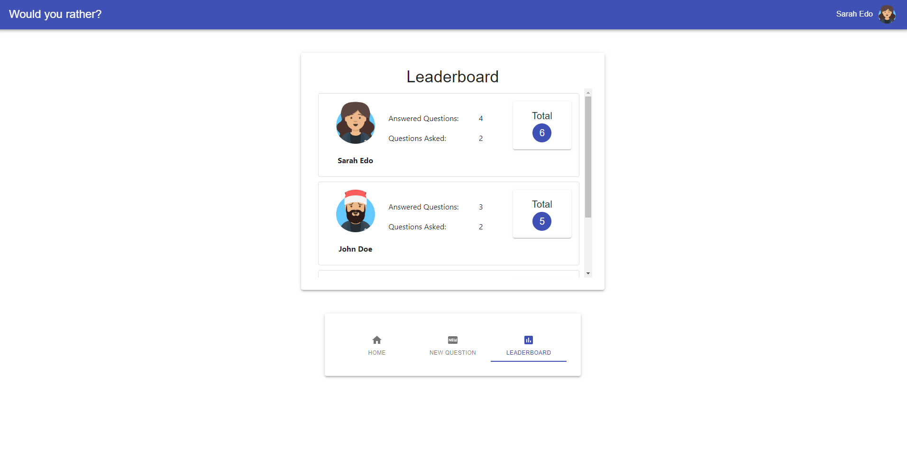

# Would You Rather Project

This is a project form Udacity's React Nanodegree called My Reads Application. The project is to help the developer practice using the Redux Store, React Router Dom and when to use the store and the component's state, 

Images used are from: https://getavataaars.com/

## Dependencies of the Project
The project has the following extensions from npm.
  1. Redux Store
  2. React Material-io
  3. React Router
  4. Redux Thunk
  
  
## Screenshots from the application
Login

HomePage

Answering a question

Adding a question

Leaderboard

## Instructions
Clone the project then `npm install` then `npm start`.

